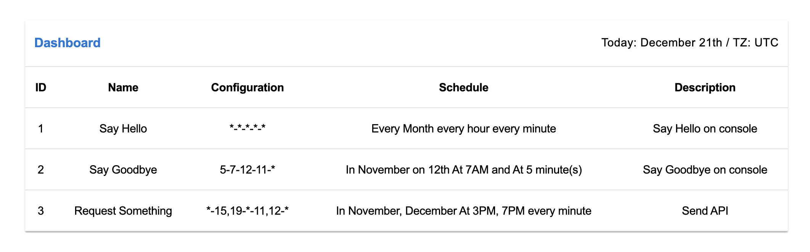

# reactjs-crontab

> Light-weight crontab for handling repetitive tasks in React js

[](https://www.npmjs.com/package/reactjs-crontab) [](https://standardjs.com)



## Installation

```bash
npm install --save reactjs-crontab
```

make sure to add date-fns as dev dependencies since this package depending on [date-fns](https://github.com/date-fns/date-fns#readme)

```bash
npm install date-fns@^2.0.0 --save-dev
```

## Inspired by

- [Linux Crontab](https://www.geeksforgeeks.org/crontab-in-linux-with-examples)

## Just updated to 1.4.0

Now it supports multiple config time values

## Crontab Config Format

```
MIN-HOUR-DOM-MON-DOW-TIMEZONE
```

OR

Can be multiple values like this

```
MIN,MIN-HOUR,HOUR-DOM,DOM-MON,MON-DOW,DOW-TIMEZONE
```

- MIN represents minute(s), can be 0 through 59
  . `*` means every minute
- HOUR represents hour(s) of a day, can be 0 through 23. `*` means every hour
- DOM represents day of month, can be 1 through 31. `*` means every day
- MON represents month, can be 1 through 12. `*` means every month
- DOW represents day of week, can be 1 through 7. 1 is Monday, 2 is Tusday and so on. `*` means every day
- TIMEZONE represent the timezone that crontab will refer to when it triggers tasks. Unfortunately, We only support 'utc timezone'. But we're working hard to improve this.
- Each sort of time value(s) must be separated by a hyphen '-'
- Multiple values must be separated by comma ','

## Basic Example

Reactjs-crontab has very similar pattern to [Linux Crontab](https://www.geeksforgeeks.org/crontab-in-linux-with-examples).
To learn linux crontab [Linux Crontab](https://www.geeksforgeeks.org/crontab-in-linux-with-examples)
The difference is that this uses dash between arguments like this `*-*-*-*-*-*`. Whereas Linux crontab uses white space like this `* * * * * *`

```jsx
import React from 'react'
import { BasicCron } from 'reactjs-crontab'
import 'reactjs-crontab/dist/index.css'

const sayHello = () => {
  console.log('Hello')
}

const sayGoobye = () => {
  console.log('Goodbye')
}

const RequestSomething = () => {
  console.log('Api request has been sent')
}

const sendNotification = () => {
  console.log('Send Event Notification')
}

const logUserOut = () => {
  console.log('log user out')
}

// these are the functions which will run according to your settings

const tasks = [
  // just put this array into BasicCron component as a props and it will work like magic!
  {
    fn: sayHello,
    id: '1',
    config: '*-*-*-*-*-utc',
    // Execute every minutes
    name: 'Say Hello',
    description: 'Say Hello on console'
  },
  {
    fn: sayGoobye,
    id: '2',
    config: '5-7-12-11-*-utc',
    // Execute In November on 12th At 7AM and At 5 minute(s)

    name: 'Say Goodbye',
    description: 'Say Goodbye on console'
  },
  {
    fn: RequestSomething,
    id: '3',
    config: '*-15,19-*-11,12-*-4',
    // Execute In November, December At 3PM, 7PM every minute
    name: 'Request Something',
    description: 'Send API'
  },
  {
    fn: sendNotification,
    id: '4',
    config: '10-11-18-7-*-utc',
    // Execute In July on 18th At 11AM and At 10 minute(s)
    name: 'Send Notification',
    description: 'Send Event Notification'
  },
  {
    fn: logUserOut,
    id: '5',
    config: '*-16-*-10-1-utc',
    // Execute In October on Monday At 4PM every minute
    name: 'Log user out'
  }
]

const App = () => {
  // this will display dashboard with scheduled tasks
  return <BasicCron tasks={tasks} />
}

export default App
```

## API

```
BasicCron Props {
  tasks [
    {
      fn: yourFn, // (required field) type function
      id: '1', // (required field) type string
      config: '*-11-18-10,13-*-utc', // (required field) type string
      name: 'logUserOut', // (optional field) type string
      description: 'Send API' // (optional field) type string
    }
  ]
}


```

## Note

- This will work well for simple crontab task but I have tons of features that I'd like to add. So stay tuned!
  Thank you so much for your attention!
- feel free to open issue. [Reactjs-crontab Github repo](https://github.com/shawnscoding/reactjs-crontab).
  Any idea that could improve this package or bug report will be highly appreciated.

## License

MIT © [shawnscoding](https://github.com/shawnscoding/reactjs-crontab/blob/master/LICENSE)
