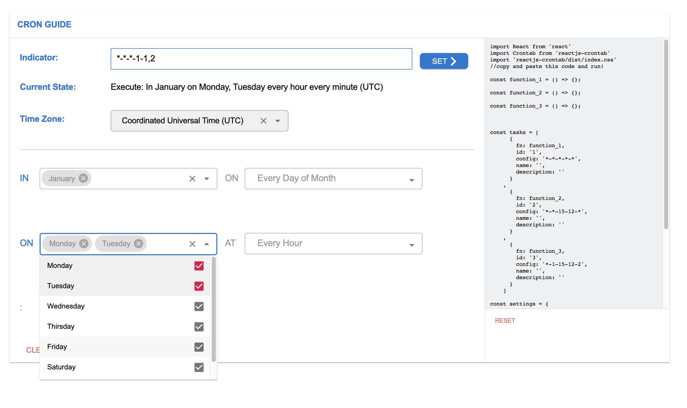

# reactjs-crontab

> Light-weight crontab for handling repetitive tasks in React js

[](https://www.npmjs.com/package/reactjs-crontab) [](https://standardjs.com)

**Demo** and **Crontab guide** at [https://d180vcwahe2y6s.cloudfront.net/build/index.html](https://d180vcwahe2y6s.cloudfront.net/index.html)



## Breaking Changes in 3.0.0

- Timezone value in config field is deprecated. remove it so it contains five values separated by hyphen like this `"*-*-*-*-*"`.
- Named import as `<BasicCron />` is deprecated.
  use default import as `<Crontab />` to use crontab

Nevertheless, if you just follow the instruction and code example below,
you won't encounter any bug or issue

## Features

- **Supports All Timezones**
- **No extra dependencies** except React
- **No style library** is used to style the components. **vanilla css** is used.
- Provide **specific error message**, you will find it so easy to debug.
- Provide **Dashboard** which enables easy monitoring of your crontab
- Provide Demo website which helps you to easily set up your crontab

## Installation

```bash
npm install --save reactjs-crontab
```

## Inspired by

- [Linux Crontab](https://www.geeksforgeeks.org/crontab-in-linux-with-examples)

## Crontab Config Format

```
MIN-HOUR-DOM-MON-DOW
```

OR

Can be multiple values like this

```
MIN,MIN-HOUR,HOUR-DOM,DOM-MON,MON-DOW,DOW
```

- MIN represents minute(s), can be 0 through 59
  . `*` means every minute
- HOUR represents hour(s) of a day, can be 0 through 23. `*` means every hour
- DOM represents day of month, can be 1 through 31. `*` means every day
- MON represents month, can be 1 through 12. `*` means every month
- DOW represents day of week, can be 1 through 7. 1 is Monday, 2 is Tusday and so on. `*` means every day
- Each sort of time value(s) must be separated by a hyphen `-`
- Multiple values must be separated by comma `,`

## Usage 1

Reactjs-crontab has very similar pattern to [Linux Crontab](https://www.geeksforgeeks.org/crontab-in-linux-with-examples)Except that this uses hyphen between arguments like this `*-*-*-*-*-utc`.

This is useful when you need to implement some function like api call at particular time.

```jsx
import React from 'react'
import Crontab from 'reactjs-crontab'
import 'reactjs-crontab/dist/index.css'

const sayHello = () => {
  console.log('Hello')
}

const sayGoobye = () => {
  console.log('Goodbye')
}

const RequestSomething = () => {
  console.log('Api request has been sent')
}

// these are the functions which will run according to your settings

const tasks = [
  // just put this array into <Crontab /> component as a props and it will work like magic!
  {
    fn: sayHello,
    id: '1',
    config: '*-*-*-*-*',
    // Execute every minutes
    name: 'Say Hello',
    description: 'Say Hello on console'
  },
  {
    fn: sayGoobye,
    id: '2',
    config: '5-7-12-11-*',
    // Execute In November on 12th At 07:05
    name: 'Say Goodbye',
    description: 'Say Goodbye on console'
  },
  {
    fn: RequestSomething,
    id: '3',
    config: '*-15,19-*-11,12-*',
    // Execute In November, December At 3PM and 7PM every minute
    // Note that this is implemented in two different hour
    name: 'Request Something',
    description: 'Send API'
  }
]

const timeZone = 'UTC'

const dashBoardSettings = {
  hidden: false
  // if true, dashboard gets hidden
}

const App = () => {
  return (
    <Crontab tasks={tasks} timeZone={timeZone} dashboard={dashBoardSettings} />
  )
}
export default App
```

Copying and pasting above code will result something like this below


This will do what it says at the requested time(s).

## Usage 2

This is useful when you need to render component
at particular time

```jsx
import React from 'react'
import Crontab from 'reactjs-crontab'
import 'reactjs-crontab/dist/index.css'

const MorningMsg = () => {
  return <div>Good Morning !</div>
}

const NightMsg = () => {
  return <div>Good Night!</div>
}

const timeZone = 'local'

const dashboardSetting = {
  hidden: true
  // if true, dashboard is hidden
}

const App = () => {
  const [openMorningMsg, setOpenMoringMsg] = React.useState(null)
  const [openNightMsg, setOpenNightMsg] = React.useState(null)

  const sayGoodMorning = () => {
    setOpenMoringMsg(true)
  }

  const sayGoodNight = () => {
    setOpenNightMsg(true)
  }

  const tasks = [
    {
      fn: sayGoodMorning,
      id: '1',
      config: '0-8-*-*-*',
      // this will run at 08:00 everyday
      name: '',
      description: ''
    },
    {
      fn: sayGoodNight,
      id: '2',
      config: '0-21-*-*-*',
      // this will run at 21:00 everyday
      name: '',
      description: ''
    }
  ]

  return (
    <div className='App'>
      <Crontab timeZone={timeZone} tasks={tasks} dashboard={dashboardSetting} />
      {openMorningMsg && <MorningMsg />}
      {openNightMsg && <NightMsg />}
    </div>
  )
}

export default App
```

Copying and pasting above code will render '<MorningMsg />' if it's 08:00 like the screenshot below


## API

```
Crontab Props {
  tasks: [
    {
      fn: yourFn,
      id: '1',
      config: '*-11-18-10,13-*',
      name: 'logUserOut',
      description: 'Send API'
    }
  ],
  timeZone: "UTC", "local" or { set: "YOUR PREFERRED TIMEZONE" },
  // you can check out supported timezone list here
  // https://github.com/shawnscoding/reactjs-crontab/blob/master/TIMEZONES.md
  dashboard: {
    hidden: false
    // if true, dashboard is hidden
  }
}

Crontab.propTypes = {
  tasks: PropTypes.arrayOf(
    PropTypes.shape({
      fn: PropTypes.func.isRequired,
      id: PropTypes.string.isRequired,
      config: PropTypes.string.isRequired,
      name: PropTypes.string,
      description: PropTypes.string
    })
  ),
  dashboard: PropTypes.shape({
    hidden: PropTypes.bool.isRequired
  }),
  timeZone: PropTypes.string.isRequired
}

Crontab.defaultProps = {
  tasks: [],
  dashboard: {
    hidden: false
  },
  timeZone: 'UTC'
}

```

## Note

- feel free to open issue. [Reactjs-crontab Github repo](https://github.com/shawnscoding/reactjs-crontab). Any idea that could improve this package or bug report will be highly appreciated.
- We'll highly appreciate it if you promote this package to other devs in any way. We believe the appropriate usage of this package will save loads of thier time.

## License

MIT © [shawnscoding](https://github.com/shawnscoding/reactjs-crontab/blob/master/LICENSE)
